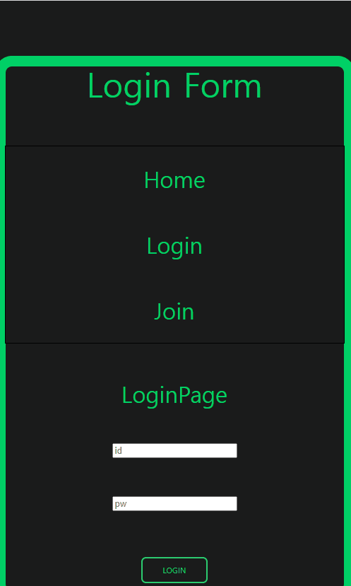

# Login Form

회원가입 로그인 기능을 구현하여 로그인에 성공했을 떄 가입시에 기입했던 유저의 정보를 열람할 수 있는 것을 목표로 하였습니다.

 - ### 가입하기

 </img>

 #### 아이디 중복확인을 거친후에 가입하기 

 - ### 로그인하기
 
 </img>

 #### 가입에 완료한 아이디와 비밀번호를 입력하여 로그인

 - ### 유저정보 열람
 </img>

 #### 가입할 때 입력한 정보를 열람할 수 있다

 - ### Error
 #### 가입 실패(중복 id로 인한 실패)
 </img>

 #### 로그인 실패(미가입 id로 인한 실패)
 </img>

## 후기

----

#### 초기목적은 localStoarage와 useContext hooks를 활용해보고 싶어서 만들었고, 처음에 useContext 내용을 이해하는 데 조금 어려움이 있었으나 블로그와 유튜브를 보다보니 Context라는 이름이 붙은 것들에 대한 개념 이해가 된 것 같다.